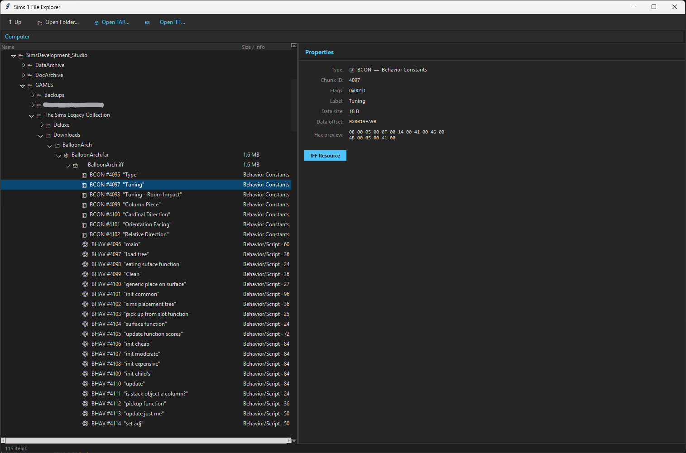

# Sims File Explorer

Lightweight explorer for **The Sims 1** archive formats.

## Features

- Browse `.far` archives
- Browse `.iff` resource contents
- Quick inspection of resource metadata and raw data
- Read archives directly without extraction
- Supports exploring **one level of ZIP nesting**
- Designed for fast browsing and research, not editing

## Current Limitations

- No editing functionality
- No export functionality
- No support for **The Sims 1.0 IFF** format
- Some IFF files do not parse correctly
- IFFs contained inside archive combinations (`zip`, `far`, `rar`, nested archives, etc.) can be problematic

## Planned

- Open Folder mode (avoid displaying the entire system tree)
- Export any selected tree branch to ASCII/text
- Unlimited nested archive exploration
  - ZIP inside ZIP
  - FAR inside ZIP
  - IFF inside FAR inside ZIP
  - Other mixed archive combinations
- Improved handling of IFF resources using RSMP chunk data
- Better support for large historical custom-content archive collections

## Status

Early exploration tool focused on viewing archive structures and IFF resource data quickly.